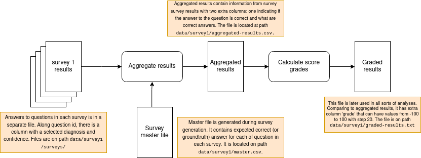

# retina-subjective-assessment
Repository contains scripts to collect, process, and store results derived from surveys produced by 
[survey-generator](https://github.com/goranagojic/survey-generator.git) project. All scripts are 
tested on Ubuntu 20.04 LTS.

## Contents

- [How to install](#how-to-install)
- [Survey type 1 support](#stype1)
    - [Aggregate results](#s1-aggregate)
    - [Calculate score](#s1-score)
    - [Boxplots](#s1-boxplots)
    - [Histogras](#s1-histograms)
- [Survey type 2 support](#stype2)
    - [Collect survey results](#s2-collect)
    - [Aggregate results](#s2-aggregate)
    - [Calclate Copeland score](#s2-copeland)

## How to install
Use conda package manager to create conda environment with all packages necessary to run the project.
```python
conda create -f environment.yml
```
If everytihing is ok, there will be newly created environment `retinasubjassesspy38` that have to be 
activated before running any of the scripts. To activate the environment type into a terminal:
```bash
conda activate retinasubjassesspy38
``` 

## Survey type 1 support
 
The whole pipeline to generate file with final graded results from survey results can be run by the following command:
```bash
python scripts/survey1/run_aggregate.py \
  --survey-dir data/survey1/surveys/json/ \
  --master-fp data/survey1/master.csv \
  --out-fp data/survey1/graded-results.csv \
  --aggregate-diabetic-retinopathy
```

For more flexibility, each step in a pipeline can be run separately. Command to aggregate separate survey results into 
a single file with groundtruth data from master file.
```bash
python aggregate.py \
    --survey-dir data/survey1/surveys/json/ \
    --master-fp data/survey1/master.csv \
    --out-fp data/survey1/aggregated-results.csv \
    --aggregate-diabetic-retinopathy
```
Parameters:
- `--survey-dir` A directory where to find survey results in JSON file format exported from SurveyJS.
- `--master-fp` A master file. The file contain information on which question is associated with which survey and 
fundus image.
- `--out-fp` A path to the output file where aggregated results will be saved. In aggregated results each answered question
 is associated with groundtruth answer.
- `--aggregate-diabetic-retinopathy` If set, diagnoses of diabetic retinopathy and background diabetic retinopathy are 

For comprehensive list of options, invoke the script with `-h` option.

To calculate grades based on answer correctness and confidence use command;
```bash
python analyze.py \
    -i data/survey1/aggregated-results.csv \
    -o data/survey1/graded-results.csv
```
Parameters:
- `-i` A path to the file with aggregated results. See bellow for file format.
- `-o` A path to the output file.

For comprehensive list of options, invoke the script with `-h` option.

### Generate plots
Use command:
```bash
python analyze.py \
    -t histogram \
    -i data/survey1/graded-results.csv \
    -o data/survey1/plots
```
Parameters:
- `-t` Specify plot type to be generated. Currently, boxplots and histograms are supported.
- `-i` A path to the master file with grading information. This file is obtained as an output of calculate grades 
command stated above.
- `-o` A path to the directory where plots will be stored. If does not exist, the directory will be created before 
plots are saved.

For comprehensive list of options, invoke the script with `-h` option.

## Survey type 2 support
Type 2 surveys ask the participants to rank eight segmentation masks for one fundus image from the best 
to the worst diagnostic quality. Each of the eight segmentation masks is produced by one of the eight selected DNNs.
The purpose of the experiment is to explore if some particular networ (architecture) is more suitable in vessel 
segmentation for diagnostic purposes then others. That said, this repo implements a pipeline where raw survey answers 
are consumed and Copeland ranking score for each of the input images is calculated. The pipeline is implemented through 
following steps.

### Collect survey results
To run raw survey results collection run the command:
```bash
python scripts/run_collect_results.py \
    --survey-dir data/survey1/raw/json \
    -o data/survey1/raw/out
```
If needed, modify path arguments to suite your needs. The script downloads all survey results from `surveyJS` server in `--survey-dir` directory. See the script for the list of all parameters.

### Aggregate results
The script aggregates all survey results into one big table where each question in each of the surveys is associated with corresponding data for images displayed in question and data for the answer selected. Since the survey type 2 is presented to the participants in two series, there are two master files containing the data that will be associated with survey results. So, the results for series 1 and 2 arE aggregated separately and then merged into a single file.

When aggregating results, just entries generated by observers 1, 2, 3, 4, and 6 are considered. All observers that are not medical experts or have not completed all the surveys have been excluded from further processing.

1. Aggregate series 1 results
```bash
python scripts/run_aggregate.py \
    --survey-dir data/survey2/survey-series-1/surveys \
    --images-filepath data/survey2/survey-series-1/metadata/segmentation-masks.csv \
    --output-dir data/survey2/survey-series-1/output/ \
    --no-final \
    --observer 1 \
    --observer 2 \
    --observer 3 \
    --observer 4 \
    --observer 6
```

2. Aggregate series 2 results
```bash
python scripts/run_aggregate.py \
    --survey-dir data/survey2/survey-series-2/surveys \
    --images-filepath data/survey2/survey-series-2/metadata/segmentation-masks.csv \
    --output-dir data/survey2/survey-series-2/output \
    --no-final \
    --observer 1 \
    --observer 2 \
    --observer 3 \
    --observer 4 \
    --observer 6
```

3. Merge series 1 and series 2 results into the single file
```bash
python scripts/run_fix_aggregate.py \
    --data-s1 data/survey2/survey-series-1/output/survey_data.csv \
    --data-s2 data/survey2/survey-series-2/output/survey_data.csv \
    --output data/survey2/survey_data.csv
```

### Calculate Copeland score
Finally, Copeland score can be calculated when `survey_data.csv` and `originals.csv` are available. The latter file is already present in `data/survey2/` directory. It contains metadata exported from the database and should be used as is.
```bash
python scripts/run_rank.py \
    --input-file data/survey2/survey_data.csv \
    --images-file data/survey2/originals.csv \
    --output-dir data/survey2
```
The output is stored on `output-dir` path in `ranking.csv` file.

Here is a pseudoalgorithm describing the process of calculating Copeland score from survey data.


